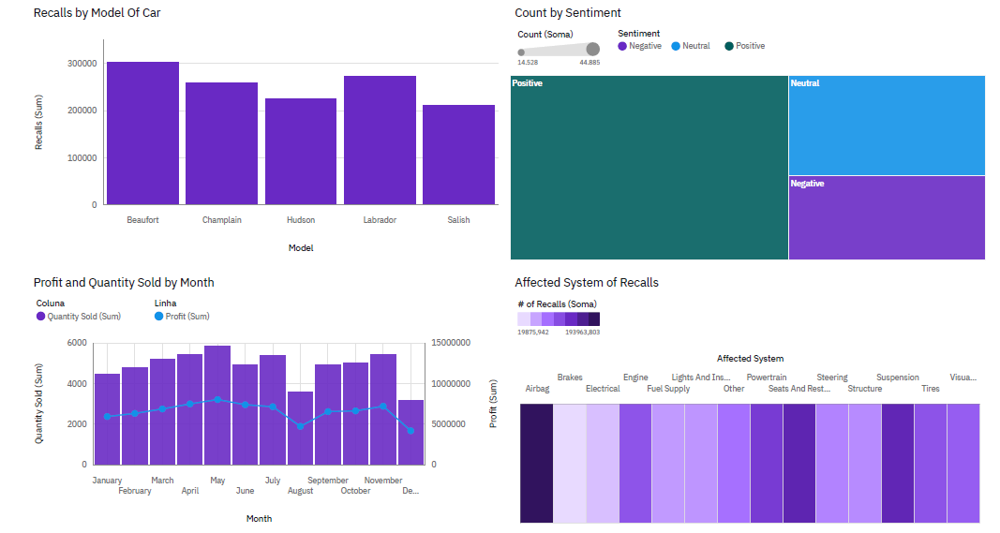

# Car Service & Recalls Dashboard | IBM Cognos Analytics

## Project Overview

Interactive Service & Recalls Dashboard built with **IBM Cognos Analytics** to analyze vehicle recall data, customer sentiment, and monthly sales performance across car models.

This project was developed as part of the **IBM Data Analyst Professional Certificate** on Coursera, specifically the course [Data Visualization and Dashboards with Excel and Cognos](https://www.coursera.org/learn/data-visualization-dashboards-excel-cognos/).

---

## Business Questions Answered

- Which car models have the highest number of recalls?
- What is the overall customer sentiment distribution (Positive, Neutral, Negative)?
- How do profit and quantity sold evolve month over month?
- Which vehicle systems are most affected by recalls?

---

## Dashboard Features

| Visual | Description |
|---|---|
| 📊 Bar Chart | Recalls by Model of Car — identifying which models generate the most recalls |
| 🗺️ Treemap | Count by Sentiment — visualizing the proportion of Positive, Neutral, and Negative feedback |
| 📈 Line & Column Chart | Profit and Quantity Sold by Month — dual-axis chart tracking sales volume and profit trends |
| 🟪 Heatmap | Affected System of Recalls — showing recall frequency by vehicle system (Airbag, Brakes, Engine, etc.) |

---

## Dashboard Preview

---

## 🛠️ Tools & Dataset

| | |
|---|---|
| **Tool** | IBM Cognos Analytics |
| **Dataset** | Car Sales by Model |
| **Course** | Data Visualization and Dashboards with Excel and Cognos — IBM / Coursera |

---

## Key Insights

- The **Beaufort** model recorded the highest number of recalls (~300K), followed closely by **Labrador** and **Champlain**, signaling potential quality concerns in those lines.
- Customer sentiment analysis revealed that **Positive** feedback dominates, though a notable share of **Negative** sentiment warrants attention for service improvement.
- The line & column chart shows that **Quantity Sold peaks mid-year** (around May–June), while **Profit fluctuates independently**, suggesting pricing or cost variations across months.
- **Airbag and Brakes** systems appear among the most frequently recalled, highlighting priority areas for quality control.

---

Data Analytics enthusiast | IBM Data Analyst Professional Certificate   
[LinkedIn](https://www.linkedin.com/in/caio-guedes-173194202)
